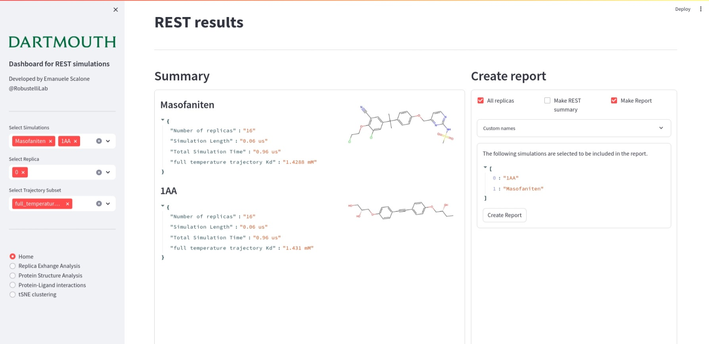
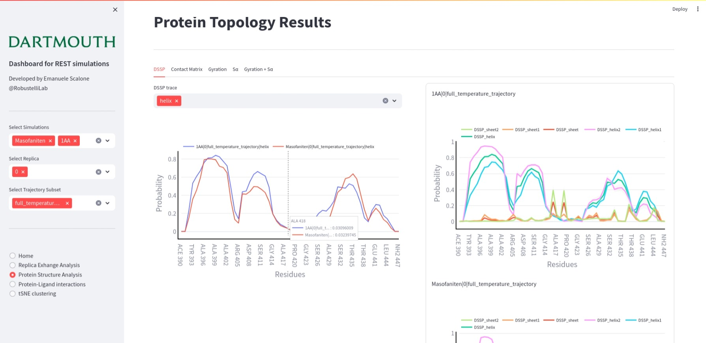
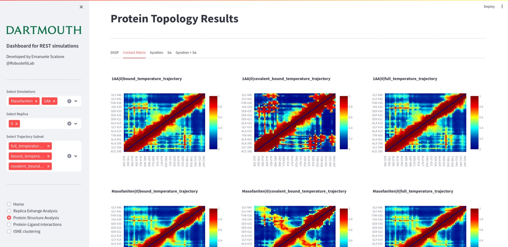
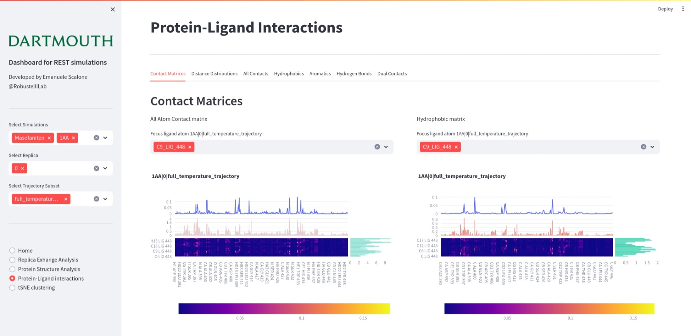
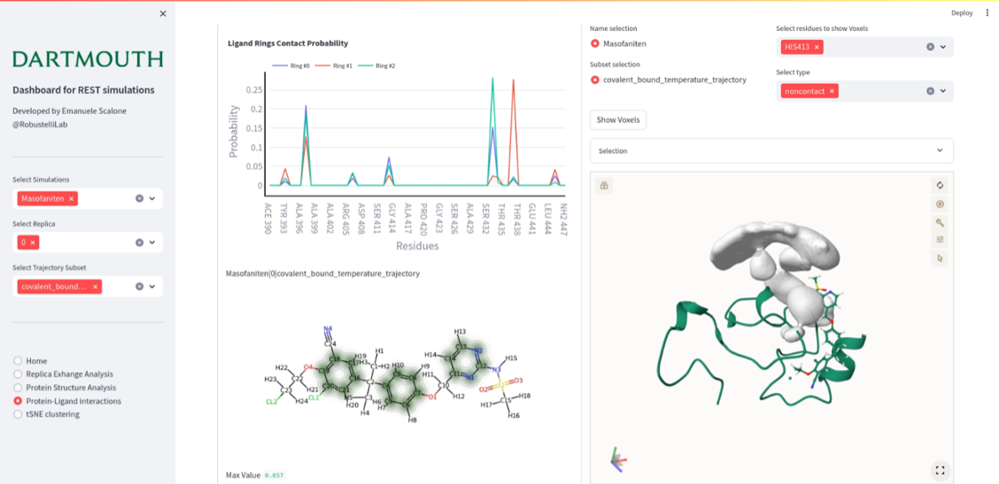

# Software for Intrinsically Disordered Protein Drug Discovery

## Current Developer:
- Emanuele Scalone

## User Interface Screenshots:
### Home
Two examples of short REST simulations are shown. A sidebar alows the selection of different systems, replica number and trajectory subset. For each selection, it is possible to select 5 pages displaying 5 different results.
In the home screen a first area display a summary of each system and if the trajectory contains small molecules, a 2D structure is displayed along with protein-ligand information.
The second area creates a two reports in a PowerPoint format. The first one regarding the REST2 analysis on every replica, the second report provides a detailed analysis on protein structures and protein-ligand interactions.

### Protein Structure Analysis - DSSP
The Protein Structure Analysis page has 5 different tabs, summarizing relevant features of solely the protein structure. In this case the first column shows the helical content for each selection. It is possible to change between helix and sheet on the selection area above the interactive plot. On the right, a detailed analysis is shown for each simulation and trajectory subset.

### Protein Structure Analysis - Contact Matrices
A second example of the Protein Structure Analysis page shows contact matrices of each system and trajectory subsets. In this case, three different subsets were selected: full trajectory, bound trajectory and covalent bound trajectory - only interacting with specific residues of our interest. For every system, a row displays the three - or more - different trajectory subsets to be conveniently compared.

### Protein-Ligand interaction - Atomistic Contact Probability
On the Protein-Ligand interaction page 7 different tabs displays all the protein-ligand interactions. In the first tab, two atomistic contact maps are shown. The first one considers all the atoms, the second one only atoms involved in hydrophobic interactions. On each matrix, the sum of contact probability is displayed, trying to represent meaningful protein regions and small molecule moieties. It is possible to select each ligand atom to show the specific contact probability profile in order to describe the most relevant interactions.

### Protein-Ligand interaction - Aromatic Contact Probability
A second example of protein-ligand interaction is the aromatic contact probability. A scrollable container on the left allows the visualization of contact probability plots and the 2D representation of such contacts. On the right a panel to select single trajectories to be loaded and visualized in 3D. Voxels represent the non-satisfied contacts by HIS 413, which could be exploited by changing the small molecule structure. Any residue can be selected along with the satisfied interactions. The 3D representation is provided by Mol* allowing some customizations on the visualization upon loading the structure. 

